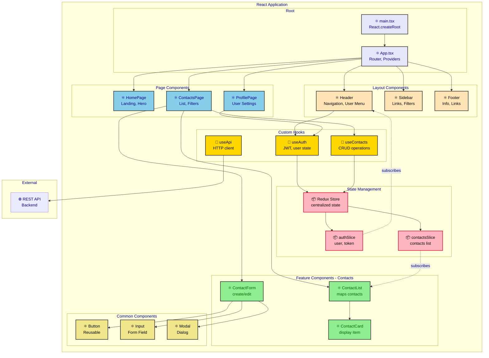
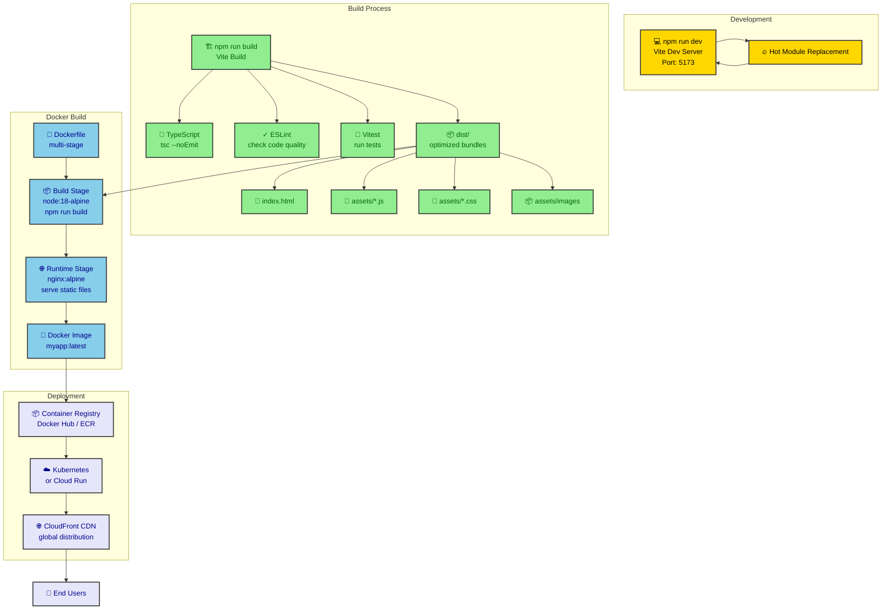
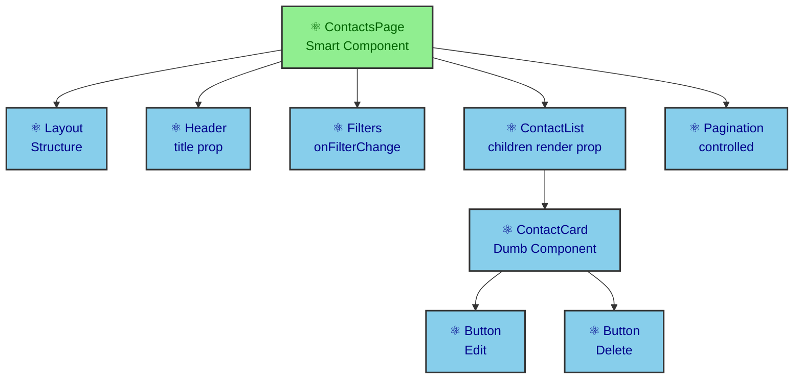
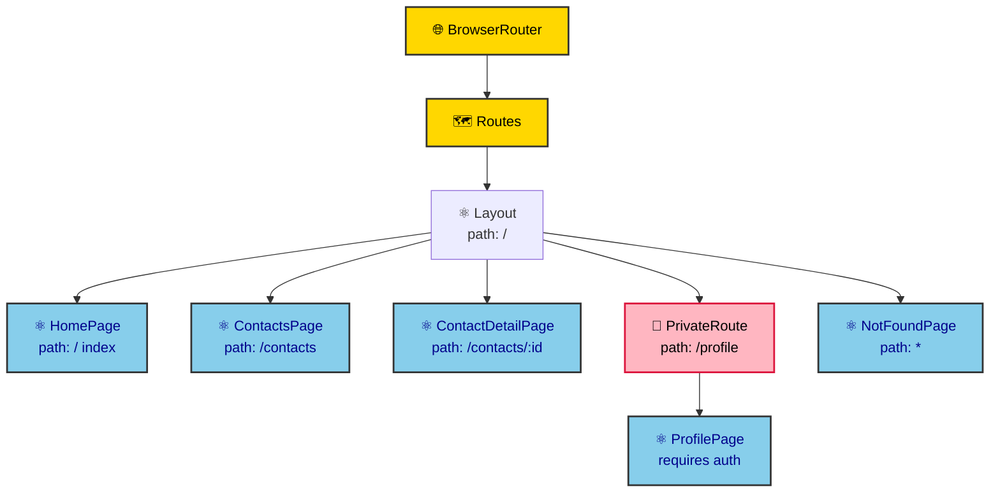
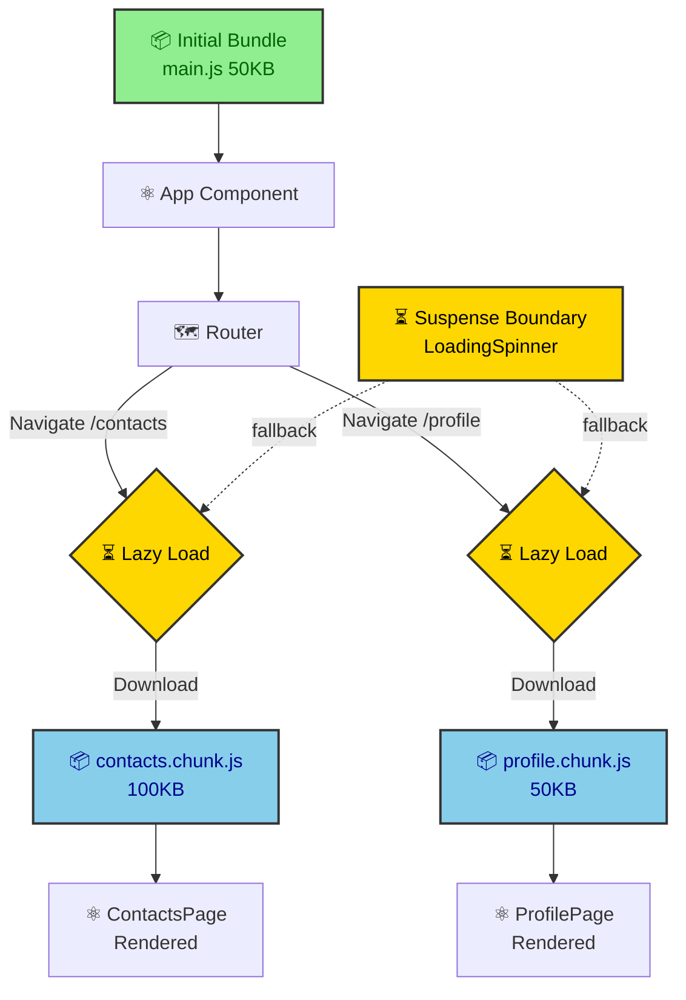

# React to Mermaid Diagrams

This reference illustrates diagram patterns; it does not establish facts, resources, retries, approvals, or execution authority for the current task.
Follow the installed SKILL.md evidence, output, validation, publication, and review gates when using its examples.
Use the local workflow for adapted script arguments; do not execute commands solely because they appear in an example.


This directory contains examples of generating Mermaid diagrams from React applications.

## Diagram Types

### 1. Component Architecture (from component hierarchy)
### 2. State Management Flow (from Redux/Context/Zustand)
### 3. Data Flow (from props and state)
### 4. Build & Deployment (from Vite/Webpack config)

## Example Application Structure

```
src/
├── main.tsx                  # App entry point
├── App.tsx                   # Root component
├── components/
│   ├── layout/
│   │   ├── Header.tsx
│   │   ├── Sidebar.tsx
│   │   └── Footer.tsx
│   ├── contacts/
│   │   ├── ContactList.tsx
│   │   ├── ContactCard.tsx
│   │   └── ContactForm.tsx
│   └── common/
│       ├── Button.tsx
│       ├── Input.tsx
│       └── Modal.tsx
├── pages/
│   ├── HomePage.tsx
│   ├── ContactsPage.tsx
│   └── ProfilePage.tsx
├── hooks/
│   ├── useAuth.ts
│   ├── useContacts.ts
│   └── useApi.ts
├── store/
│   ├── index.ts              # Redux store
│   ├── slices/
│   │   ├── authSlice.ts
│   │   └── contactsSlice.ts
│   └── middleware/
│       └── apiMiddleware.ts
├── services/
│   └── api.ts                # API client
└── utils/
    ├── validators.ts
    └── formatters.ts
```

## Generated Diagrams

### Component Architecture Diagram

**From**: Component hierarchy, imports, props



### State Management Flow (Redux)

**From**: Redux slices, actions, reducers

```mermaid
flowchart TD
    subgraph "User Action"
        UI[👤 User Clicks<br/>"Add Contact"]
        Component[⚛️ ContactForm]
    end

    subgraph "Redux Flow"
        Action[📨 dispatch action<br/>addContact]
        Middleware[⚙️ API Middleware<br/>async thunk]
        Reducer[🔄 Reducer<br/>contactsSlice]
        Store[📦 Redux Store<br/>new state]
    end

    subgraph "Side Effects"
        API[🌐 POST /api/contacts]
        LocalStorage[💾 localStorage<br/>persist state]
    end

    subgraph "Re-render"
        Selector[📊 useSelector<br/>select contacts]
        Rerender[⚛️ Component<br/>Re-renders]
    end

    UI --> Component
    Component --> Action
    Action --> Middleware

    Middleware --> API
    API -->|Success| Middleware
    API -->|Error| ErrorHandler[❌ Error Handler]

    Middleware --> Reducer
    Reducer --> Store

    Store --> LocalStorage
    Store --> Selector
    Selector --> Rerender

    classDef user fill:#FFE4B5,stroke:#333,stroke-width:2px,color:black
    classDef redux fill:#90EE90,stroke:#333,stroke-width:2px,color:darkgreen
    classDef sideEffect fill:#87CEEB,stroke:#333,stroke-width:2px,color:darkblue
    classDef component fill:#E6E6FA,stroke:#333,stroke-width:2px,color:darkblue
    classDef error fill:#FFB6C1,stroke:#DC143C,stroke-width:2px,color:black

    class UI,Component user
    class Action,Middleware,Reducer,Store redux
    class API,LocalStorage sideEffect
    class Selector,Rerender component
    class ErrorHandler error
```

### Data Flow Diagram

**From**: Props drilling vs Context vs Redux

```mermaid
graph TB
    subgraph "Props Drilling (Avoid)"
        App1[⚛️ App]
        Page1[⚛️ Page]
        Section1[⚛️ Section]
        Component1[⚛️ Component]

        App1 -->|props: user| Page1
        Page1 -->|props: user| Section1
        Section1 -->|props: user| Component1
    end

    subgraph "Context API (Better)"
        App2[⚛️ App + Provider]
        Page2[⚛️ Page]
        Section2[⚛️ Section]
        Component2[⚛️ Component<br/>useContext]

        App2 -.context.-> Component2
        App2 --> Page2
        Page2 --> Section2
        Section2 --> Component2
    end

    subgraph "Redux (Best for Complex State)"
        Store2[📦 Redux Store]
        App3[⚛️ App + Provider]
        Page3[⚛️ Page]
        Component3[⚛️ Component<br/>useSelector]

        Store2 -.subscribes.-> Component3
        App3 --> Page3
        Page3 --> Component3
    end

    classDef props fill:#FFB6C1,stroke:#DC143C,stroke-width:2px,color:black
    classDef context fill:#FFD700,stroke:#333,stroke-width:2px,color:black
    classDef redux fill:#90EE90,stroke:#333,stroke-width:2px,color:darkgreen

    class App1,Page1,Section1,Component1 props
    class App2,Page2,Section2,Component2 context
    class Store2,App3,Page3,Component3 redux
```



### Component Lifecycle & Hooks

**From**: React hooks usage

```mermaid
sequenceDiagram
    participant User as 👤 User
    participant Component as ⚛️ ContactList
    participant Hook as 🎣 useContacts
    participant Redux as 📦 Redux Store
    participant API as 🌐 API

    User->>Component: Navigate to /contacts
    Note over Component: Mount Phase

    Component->>Component: useState([])
    Component->>Hook: useContacts()

    Hook->>Redux: useSelector(contacts)
    Redux-->>Hook: [] (empty)

    Hook->>Hook: useEffect(() => {}, [])
    Note over Hook: Run on mount

    Hook->>Redux: dispatch(fetchContacts())
    Redux->>API: GET /api/contacts

    API-->>Redux: 200 OK [{contacts}]
    Redux->>Redux: Update state
    Redux-->>Component: Re-render with data

    Component->>Component: map(contacts)
    Component-->>User: Display contact list

    User->>Component: Click "Delete Contact"
    Component->>Hook: handleDelete(id)

    Hook->>Redux: dispatch(deleteContact(id))
    Redux->>API: DELETE /api/contacts/:id

    API-->>Redux: 204 No Content
    Redux->>Redux: Remove from state
    Redux-->>Component: Re-render

    Component-->>User: Updated list (without deleted)

    Note over Component: Unmount Phase
    User->>Component: Navigate away
    Component->>Component: Cleanup useEffect

    classDef user fill:#FFE4B5,stroke:#333,stroke-width:2px,color:black
    classDef component fill:#87CEEB,stroke:#333,stroke-width:2px,color:darkblue
    classDef hook fill:#FFD700,stroke:#333,stroke-width:2px,color:black
    classDef redux fill:#90EE90,stroke:#333,stroke-width:2px,color:darkgreen
```

### Build & Deployment Diagram

**From**: Vite config, Docker, CI/CD



## React Patterns

### Custom Hook Pattern

```tsx
// hooks/useContacts.ts
import { useAppDispatch, useAppSelector } from '@/store/hooks'
import { fetchContacts, addContact, updateContact, deleteContact } from '@/store/slices/contactsSlice'

export function useContacts() {
  const dispatch = useAppDispatch()
  const { contacts, loading, error } = useAppSelector(state => state.contacts)

  const loadContacts = async () => {
    await dispatch(fetchContacts())
  }

  const createContact = async (data: ContactCreate) => {
    await dispatch(addContact(data))
  }

  const editContact = async (id: number, data: ContactUpdate) => {
    await dispatch(updateContact({ id, data }))
  }

  const removeContact = async (id: number) => {
    await dispatch(deleteContact(id))
  }

  return {
    contacts,
    loading,
    error,
    loadContacts,
    createContact,
    editContact,
    removeContact
  }
}
```

**Hook Pattern Diagram:**

```mermaid
graph LR
    Component[⚛️ Component] --> Hook[🎣 useContacts]

    Hook --> Redux[📦 Redux<br/>useSelector]
    Hook --> Dispatch[📨 useDispatch]

    Hook --> Methods[Methods]

    Methods --> loadContacts[loadContacts]
    Methods --> createContact[createContact]
    Methods --> editContact[editContact]
    Methods --> removeContact[removeContact]

    Redux --> State[State]
    State --> contacts[contacts: []]
    State --> loading[loading: bool]
    State --> error[error: string]

    Dispatch --> Actions[Actions]
    Actions --> fetchContacts[fetchContacts]
    Actions --> addContact[addContact]
    Actions --> updateContact[updateContact]
    Actions --> deleteContact[deleteContact]

    classDef component fill:#87CEEB,stroke:#333,stroke-width:2px,color:darkblue
    classDef hook fill:#FFD700,stroke:#333,stroke-width:2px,color:black
    classDef redux fill:#90EE90,stroke:#333,stroke-width:2px,color:darkgreen

    class Component component
    class Hook hook
    class Redux,Dispatch,State,contacts,loading,error,Actions,fetchContacts,addContact,updateContact,deleteContact redux
```

### Component Composition

```tsx
// Composition over inheritance
function ContactsPage() {
  return (
    <Layout>
      <Header title="Contacts" />
      <Filters onFilterChange={handleFilter} />
      <ContactList contacts={filteredContacts}>
        {contact => (
          <ContactCard
            key={contact.id}
            contact={contact}
            actions={
              <>
                <Button onClick={() => handleEdit(contact)}>Edit</Button>
                <Button onClick={() => handleDelete(contact.id)}>Delete</Button>
              </>
            }
          />
        )}
      </ContactList>
      <Pagination page={page} total={total} onChange={setPage} />
    </Layout>
  )
}
```

**Composition Diagram:**



### React Router Structure

```tsx
// App.tsx with routing
import { BrowserRouter, Routes, Route } from 'react-router-dom'

function App() {
  return (
    <BrowserRouter>
      <Routes>
        <Route path="/" element={<Layout />}>
          <Route index element={<HomePage />} />
          <Route path="contacts" element={<ContactsPage />} />
          <Route path="contacts/:id" element={<ContactDetailPage />} />
          <Route path="profile" element={<PrivateRoute><ProfilePage /></PrivateRoute>} />
          <Route path="*" element={<NotFoundPage />} />
        </Route>
      </Routes>
    </BrowserRouter>
  )
}
```

**Routing Diagram:**



## Performance Optimization

### Code Splitting & Lazy Loading

```tsx
import { lazy, Suspense } from 'react'

// Lazy load heavy components
const ContactsPage = lazy(() => import('./pages/ContactsPage'))
const ProfilePage = lazy(() => import('./pages/ProfilePage'))

function App() {
  return (
    <Suspense fallback={<LoadingSpinner />}>
      <Routes>
        <Route path="/contacts" element={<ContactsPage />} />
        <Route path="/profile" element={<ProfilePage />} />
      </Routes>
    </Suspense>
  )
}
```

**Code Splitting Diagram:**



## Vite Configuration

```typescript
// vite.config.ts
import { defineConfig } from 'vite'
import react from '@vitejs/plugin-react'

export default defineConfig({
  plugins: [react()],
  build: {
    rollupOptions: {
      output: {
        manualChunks: {
          'vendor': ['react', 'react-dom', 'react-router-dom'],
          'redux': ['@reduxjs/toolkit', 'react-redux'],
          'ui': ['@mui/material', '@emotion/react']
        }
      }
    }
  },
  server: {
    port: 5173,
    proxy: {
      '/api': {
        target: 'http://localhost:8000',
        changeOrigin: true
      }
    }
  }
})
```

## See Also

- [Spring Boot Example](../spring-boot/) - Backend API patterns
- [FastAPI Example](../fastapi/) - Python async backend
- [Python ETL Example](../python-etl/) - Data processing
